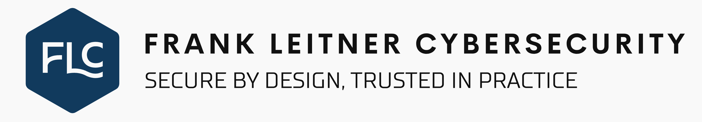

# .github

Most product organizations facing the EU Cyber Resilience Act or IEC 62443 don't have a security problem. They have a translation problem: requirements that nobody in the engineering team knows how to turn into a sprint ticket.

I close that gap.

With 15+ years in software development and architecture (primarily C++) and deep expertise in product and industrial security, I work at the intersection where the standards meet the codebase. I've been the person writing the software. That changes how I engage with engineering teams: not as an auditor dropping findings, but as someone who understands the constraints they're actually working under.

My work focuses on manufacturers of software-driven and connected products who need to implement IEC 62443, build a Secure SDLC, or prepare for CRA compliance without derailing their roadmap. That typically means structured threat modeling, security architecture, gap analysis against 62443-4-1 and 4-2, and translating regulatory requirements into concrete, verifiable engineering activities.

The goal is security that becomes part of how the product is built, not a gate at the end.

If your team is staring at a compliance deadline and needs someone who can make it technically real, let's talk.

ISA/IEC 62443 Cybersecurity Expert | CISSP | ISSAP | CISA | CISM | CRISC | OSCP